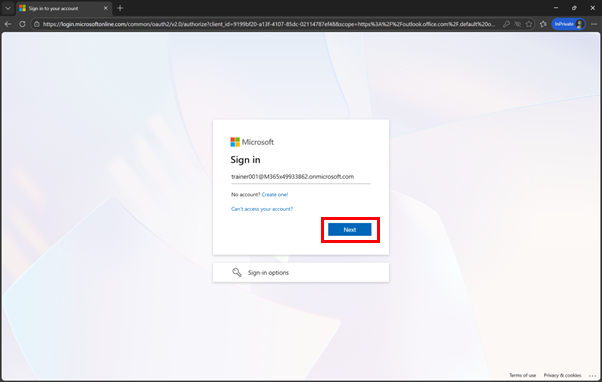
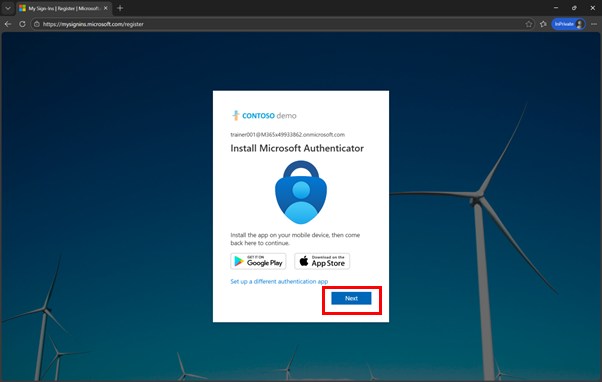
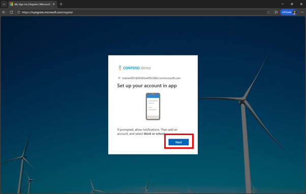
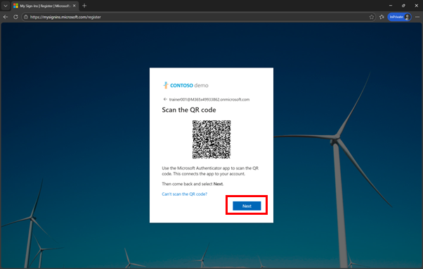
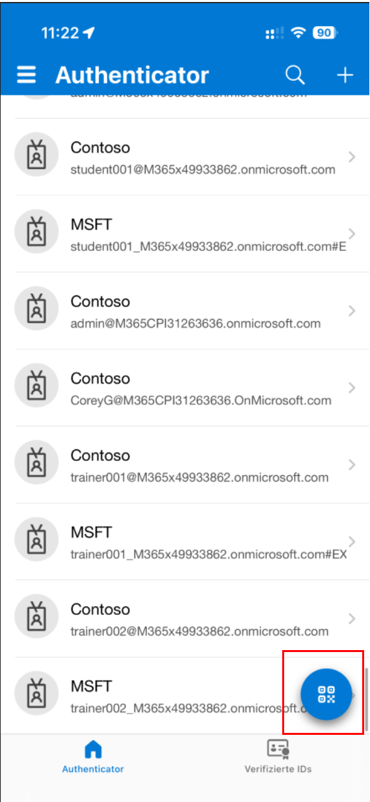
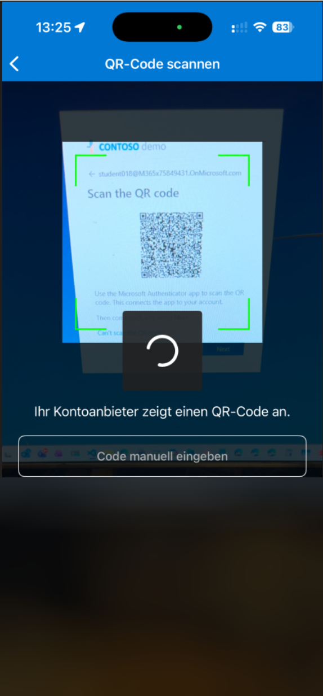
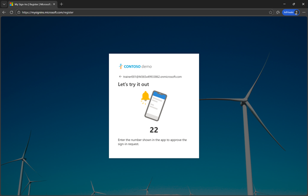
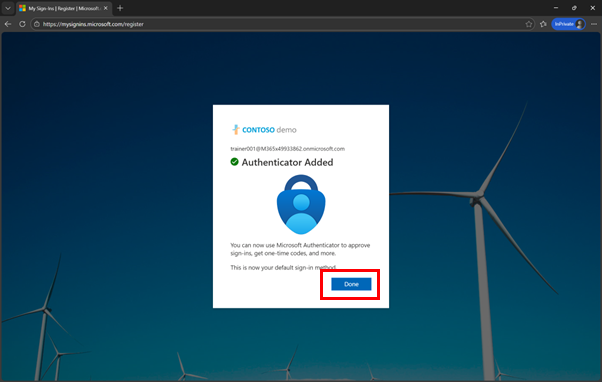
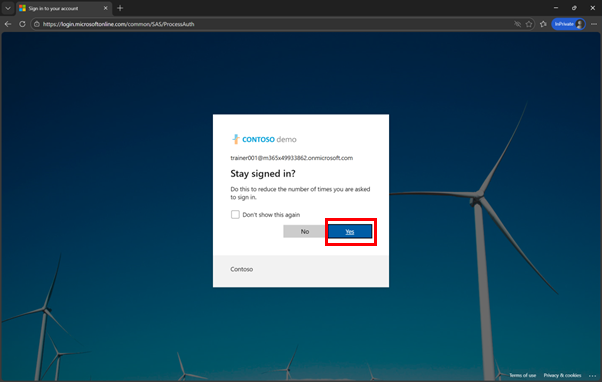
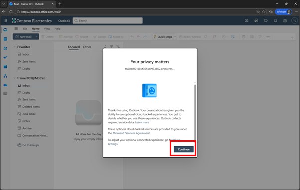

# Copilot Studio & SAP: Getting started

**[🤖 Quest 1 >](student/Quest1.md)**

## Introduction
Welcome to the Syntax & Microsoft Hackathon: Microsoft & SAP Integration Hands-on lab. This document provides an overview of the Hands-on activities, challenges, and resources available to participants.

Copilot Studio is Microsoft’s low-code platform for building, customizing, and managing AI-powered copilots and agents. It enables organizations to create conversational assistants that understand natural language, ground responses in enterprise knowledge, and interact with users across channels like Microsoft Teams, websites, and Microsoft 365 applications.

With Copilot Studio, both business users and developers can extend Microsoft 365 Copilot or create standalone agents that automate workflows, call APIs, and integrate with enterprise systems using connectors and Power Automate. The platform provides built-in governance, security, and analytics, making it possible to scale AI agents safely and reliably across the organization.

## Getting started with Copilot Studio and OData Services
In this first exercise we want to show the power of LLMs and OData services. OData services provide a simple access to data from SAP systems: to read, update, write and delete data. Using principal propagation all of this can also be done in the users context, so that licenses, but also audit requirements are fully intact. 

Each user will get their own Copilot Studio client from which they can connect to an SAP system. At first we will perform a simple read call, but then we want to switch to a dynamic lookup and creating of the required OData services. 

Before we go to the OData integration in Copilot Studio, we want to get ourselves familiar with OData. 

In this exercise we will connect to the GW SAMPLE Service available in lots of SAP systems. Similar to the SFLIGHT or the Northwind services, the GWSAMPLE service provides a good way to test enterprise data via OData. 

## Users
We have two kinds of users. For the SAP system we will share one technical user: 

For Copilot Studio everyone will get their own Microsoft Entra ID user. Password will be handed out during the lab. 

|User ID |
|----|
student0**01**@tws22.onmicrosoft.com
...
student0**25**@tws22.onmicrosoft.com

## Getting started
### Prepare the User
#### Open Outlook:
Just to ensure that user-credentials are working and to setup MFA, open https://outlook.office.com

> [!NOTE]
> You might want to start a "New InPrivate Window" in your browser

> [!NOTE]
> Login with your user, like *student0XX@M365x75849431.OnMicrosoft.com*

#### Enter the provided password:

 
#### Setup MFA
Click on **Next**

 
#### If required, install Authenticator on your mobile device
Click on **Next**

 
#### Click on Next

 
#### Scan the QR Code with your Authenticator App

Open the Authenticator app on your phone and click on the "QR" code symbol on the bottom right

Capture the QR Code with your phone and click on **Next** in the Browser

 
#### You should get a confirmation on your mobile device

 
#### And the Authenticator is added

 
#### Click on Yes to stay signed-in 

 
#### If required, click on Continue

 

You should now have access to your users Outlook and MFA is setup and configured. 

Now let's try to connect to Copilot Studio first by opening http://copilotstudio.microsoft.com/ 
> Loading Copilot Studio for the very first time, can take some time. So even if the studio does not load immediately, just wait and continue with the next steps. 

## 📢Feedback

This repos encourages contributions and feedback via the [GitHub Issues](https://github.com/hobru/Microsoft-Copilot-Studio-und-SAP/issues/new/choose).

## Where to next?

**[🤖 Quest 1 >](student/Quest1.md)**

[🔝](#)
