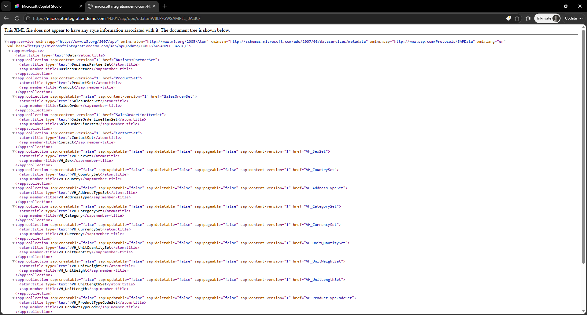
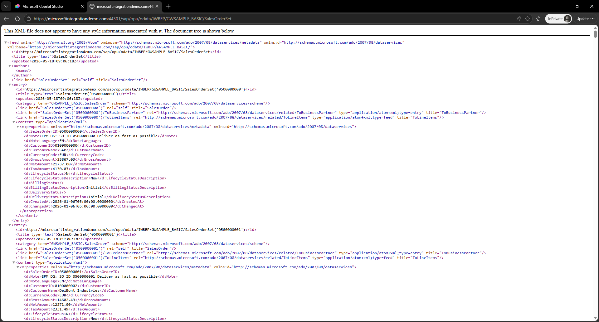
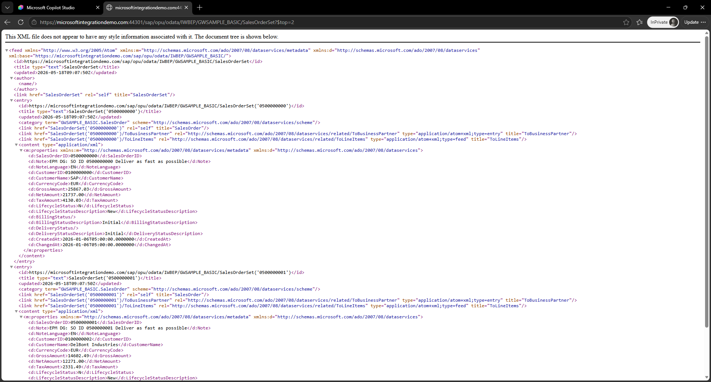
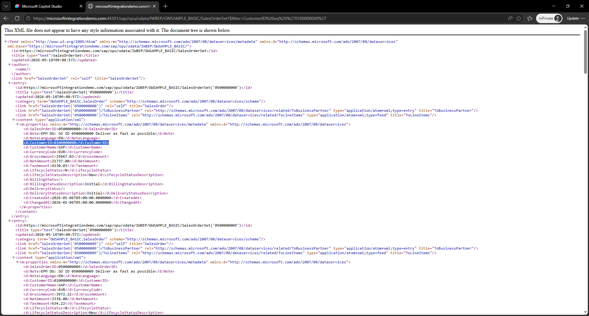
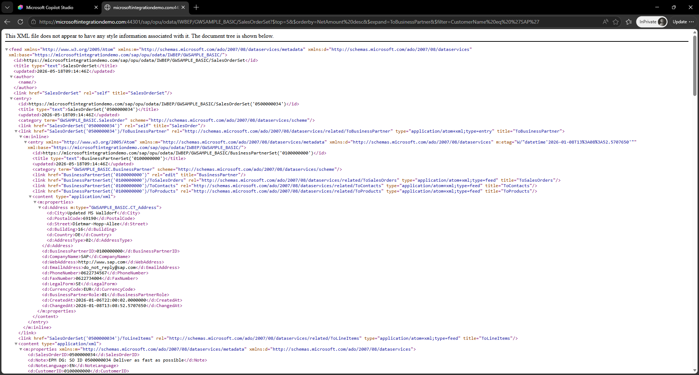

# 🤖 1. Challenge 1: Getting started with OData
[🏠Home](../README.md) - **[🔌 Quest 2 >](Quest2.md)**

1.1. OData Services @ SAP
OData services are the foundation of many scenarios in SAP. Whether it is SAP Fiori scenarios, CDS Views exposed as OData services or all the thousands of OData services listed on the SAP API Business Accelerator Hub. 

In order to better understand how an OData service behaves, let's get started by calling the root service via

````http
https://microsoftintegrationdemo.com:44301/sap/opu/odata/IWBEP/GWSAMPLE_BASIC/
````

Login with the user **SYNTAX01**

As a result you can see the technical response of the OData service.


All the information you can fetch is clustered in collection, e.g. SalesOrderSet. 
If you change the URL to 

````http
https://microsoftintegrationdemo.com:44301/sap/opu/odata/IWBEP/GWSAMPLE_BASIC/SalesOrderSet
````

You get a long list of Sales Orders back



To limit the number of sales orders, the simplest way is just to ask for the first top 2, 
````http
https://microsoftintegrationdemo.com:44301/sap/opu/odata/IWBEP/GWSAMPLE_BASIC/SalesOrderSet?$top=2
````



Now if you want to filter for a specific property, you can just specify the property you are interested in and filter for that (if the underlying OData service supports that), e.g.

````http
https://microsoftintegrationdemo.com:44301/sap/opu/odata/IWBEP/GWSAMPLE_BASIC/SalesOrderSet?$filter=CustomerID%20eq%20%270100000000%27
````

Here we have added the parameter: *$filter=CustomerID eq '0100000000'* to the URL which returns only Sales Orders for this specific CustomerID



OData provides lots of different ways to filter and navigate through the data on the SAP side. You can also combine different queries to get to the information you are interested in. The following request returns the top 5 sales orders, sorted by NetAmount including the Business Partner information in descending order by customer SAP. 
````http
https://microsoftintegrationdemo.com:44301/sap/opu/odata/IWBEP/GWSAMPLE_BASIC/SalesOrderSet?$top=5&$orderby=NetAmount%20desc&$expand=ToBusinessPartner&$filter=CustomerName%20eq%20%27SAP%27
````




You can see that the queries can become quite complex. That's where LLM can help and dynamically create the required filters to get the data you are interested in. 

But before we go there, let's start with a simple OData integration to Copilot Studio. 


# Where to next?

[🏠Home](../README.md) - **[🔌 Quest 2 >](Quest2.md)**

[🔝](#)
