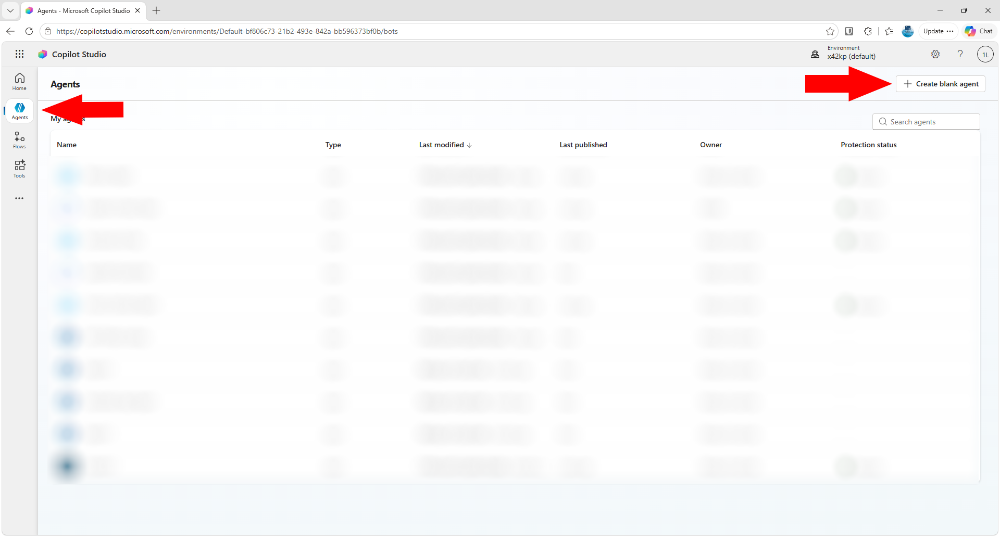
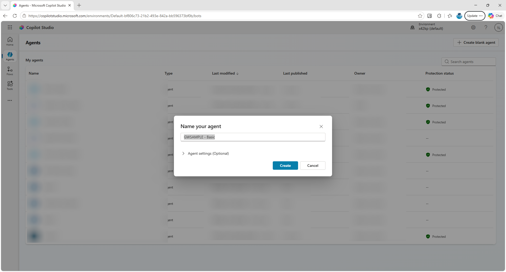
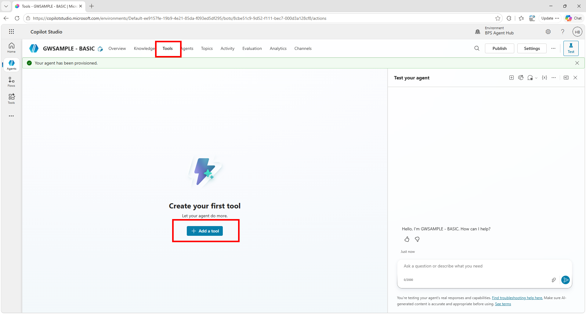
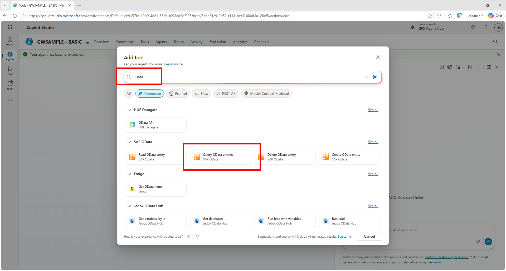
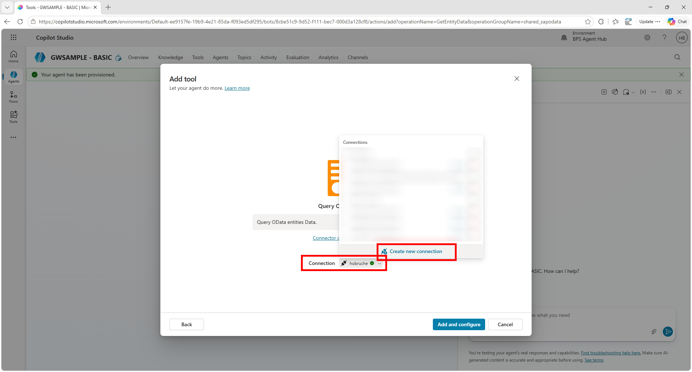
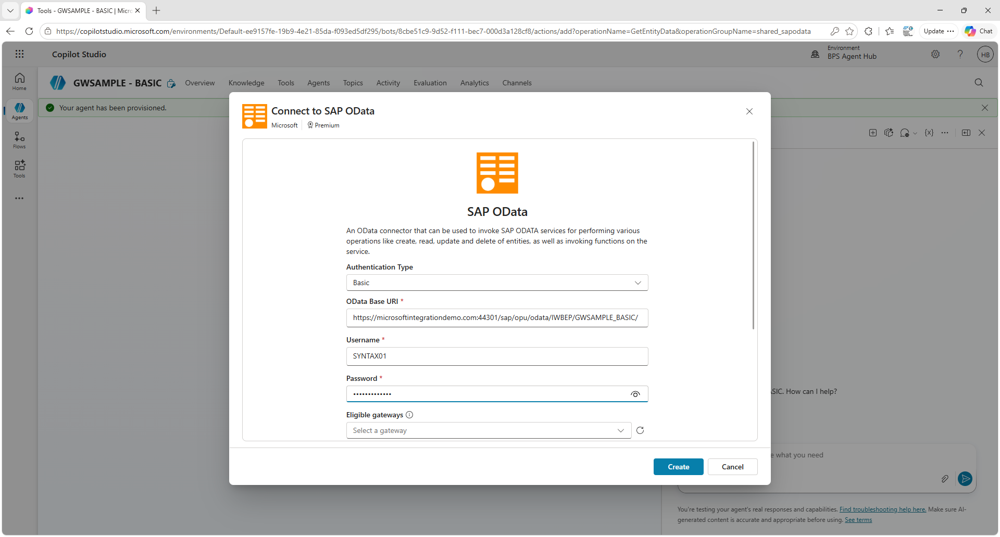
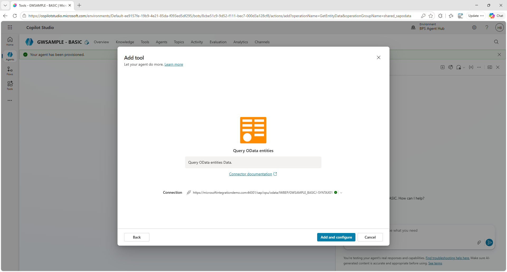
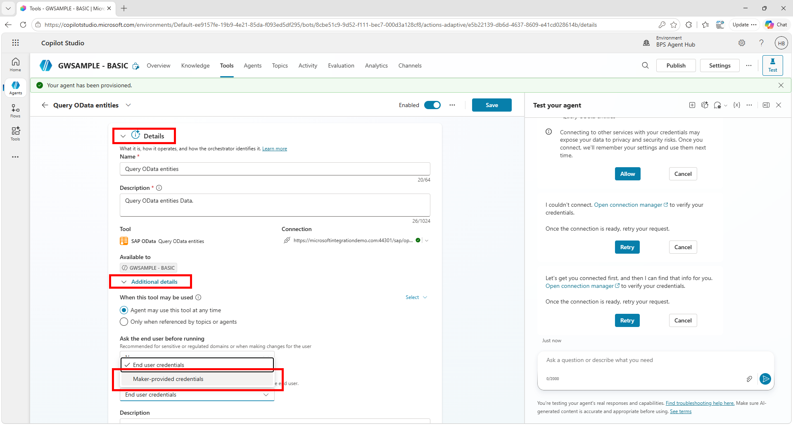
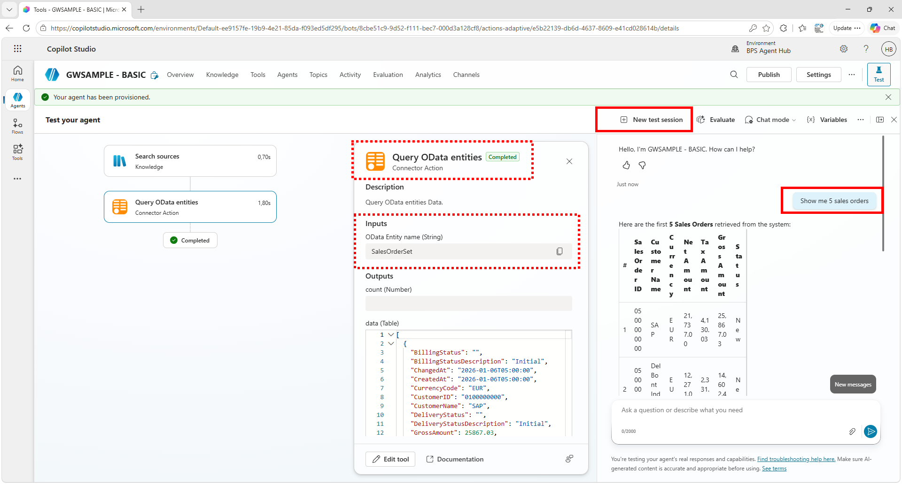
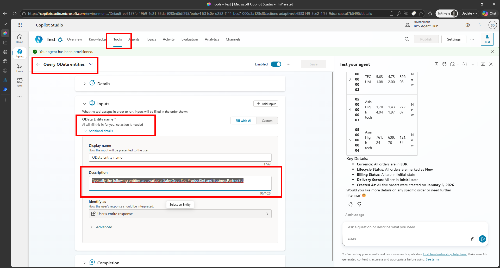

# Quest 2: Connect to SAP OData Services from Copilot Studio
[< 🤖 Quest 1](Quest1.md) - [🏠Home](../../README.md)

## Connecting Copilot Studio to OData
Now that we have a basic understanding of OData Service, the next step is to connect Copilot Studio to an OData service. 
We will do a simple integration to show the concept and outline how easily it can be to connect. 

In [Copilot Studio](https://copilotstudio.microsoft.com/) go to **Agents** and click on **+ Create blank agent**


Enter the name ````GWSAMPLE - Basic```` and click on **Create**


Once the Agent is setup, go to **Tools** and click on **"+ Add a tool"**


Search for **OData** and select the **Query OData Entities** tool


In the first step we need to create a connection to the SAP system. Click on **Connection** and select **Create new connection**


The SAP OData Connector in Copilot Studio allows you to browse available Entity Sets. So enter the OData Base URI for the GWSAMPLE Service:
* OData Base URI: https://microsoftintegrationdemo.com:44301/sap/opu/odata/IWBEP/GWSAMPLE_BASIC/
* Username: SYNTAX01
* Password: <as provided>




Once entered, click on **Add and configure**




To simplify the interaction, expand the **Details** section and under **Additional details** change the **Credentials to use** to **Maker-provided credentials**. Then click on **Save**




Now when you click on **+ New Test session** you can already interact with your SAP system. Start by asking a question ````Show me 5 sales orders````




You can see that Copilot Studio was able to identify the right tool (e.g. Query OData entities), that it selected the correct Entity name (e.g. SalesOrderSet) and it returned a list of Sales Orders. 

You can do similar query with:
* ````Show me 3 products````
* ````Show me 3 business partners````


> Note:
If the lookup does not work and the agent is not able to connect to the SAP OData service, then give it some help. Go to **Tools**, **Query OData entties**, **Inputs**, **Additional details** and change the **description** to 
````text
Typically the following entities are available: SalesOrderSet, ProductSet and BusinessPartnerSet
````




## Summary
This section showed how to easily access OData services. More complex OData integration scenarios can be developed using Flows, see also https://www.youtube.com/watch?v=zt62mhPr_k0


# Where to next?

[< 🤖 Quest 1](Quest1.md) - [🏠Home](../../README.md)

[🔝](#)
