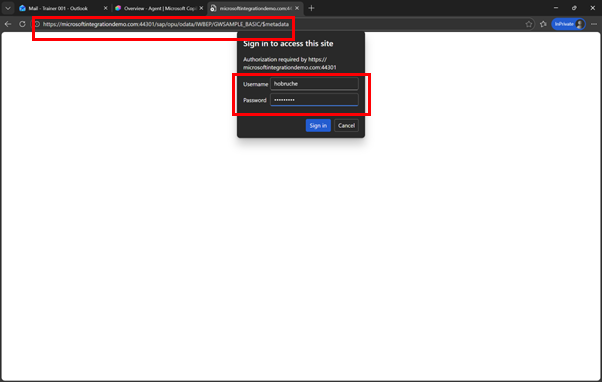
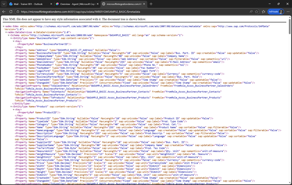
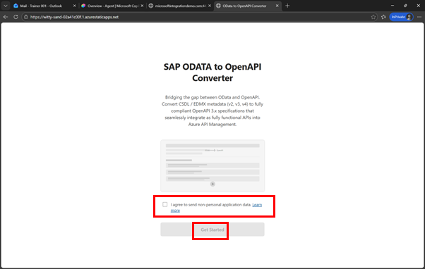
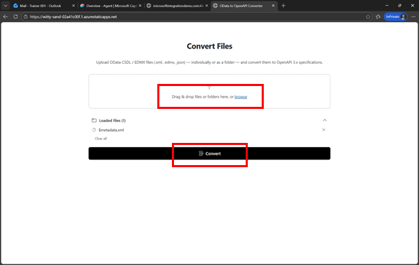
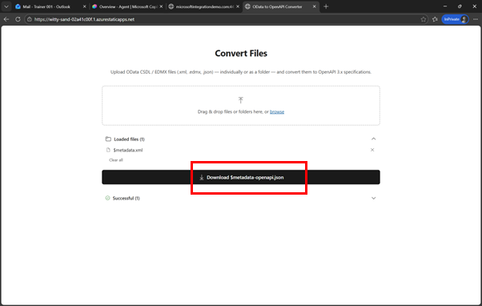

# Quest 1: Getting Started - Prepare access
[🏠Home](../../README.md) - **[🔌 Quest 2 >](Quest2.md)**


In this section we will make sure that you have access to all the required system: 
* Copilot Studio – To Create the actual agent
* Azure API Management – To manage APIs and create the MCP Server
* The SAP Backend system – where the actual data is coming from

As before we will use the GWSAMPLE Service to connect to our SAP System. 

## Access the SAP System, connect to the OData service and convert to OpenAPI
For our tests we are going to use the GWSAMPLE Service, https://microsoftintegrationdemo.com:44301/sap/opu/odata/IWBEP/GWSAMPLE_BASIC/


Open a new Browser Tab and download the $metadata information, via. 

```text
https://microsoftintegrationdemo.com:44301/sap/opu/odata/IWBEP/GWSAMPLE_BASIC/$metadata
```


## Authenticate 
Make sure to logon with the user **SYNTAX** and the password provided:
 
  
## Save the file 
On your keyboard press **Strg-S** to save the file (or **right-click** -> **Save-As**)

> [!NOTE]
> You can keep the default filename: **$metadata**

 

> [!NOTE]
> If you had issues with the **$metadata** files you can also use this file [$metadata file](../files/$metadata.xml)


 
## Convert this metadata file to an OpenAPI Specification. 
For this we use the website https://witty-sand-02a41c00f.1.azurestaticapps.net/

Open the page, **select** “I agree” and click on **Get started**.

 
 
## Convert Files
Click on **Browse**, select the **$metadata** file you downloaded before and click on **Convert**. 
 
 
## Download the converted file 
Click on **Download $metadata-openapi.json** to download the now converted file 
 
 


# Where to next?

[🏠Home](../../README.md) - **[🔌 Quest 2 >](Quest2.md)**

[🔝](#)
