# Quest 2: Manage APIs in Azure API Management
[< 🤖 Quest 1](Quest1.md) - **[🔧 Quest 3 >](Quest3.md)**

## Azure API Management
Azure API Management (APIM) is a fully managed service that helps organizations securely publish, expose, and manage APIs at scale. It acts as a façade between API consumers and backend services, providing a consistent entry point where developers can discover APIs, learn how to use them, and access them in a controlled way.

At the same time, Azure API Management gives API owners powerful control and observability. It enables policies for authentication, throttling, transformation, and caching, while offering built‑in monitoring, analytics, and versioning. This makes it easier to protect backend services, ensure reliability, and evolve APIs without breaking consumers.


### Open Azure API Management in the Azure Portal:
Open a new browser tab and open the link:

https://portal.azure.com/#@tws22.onmicrosoft.com/resource/subscriptions/0973cd86-8527-4a13-a1c8-b3431c0e1fde/resourceGroups/syntax2026-apim/providers/Microsoft.ApiManagement/service/syntax2026apim/apim-apis


### Accept Permissions
Click on **Accept**

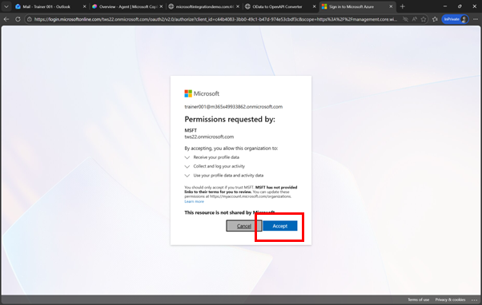 

### Add to Authenticator App
Since this is an external user in this Azure subscription you need to add also this user to the Authenticator

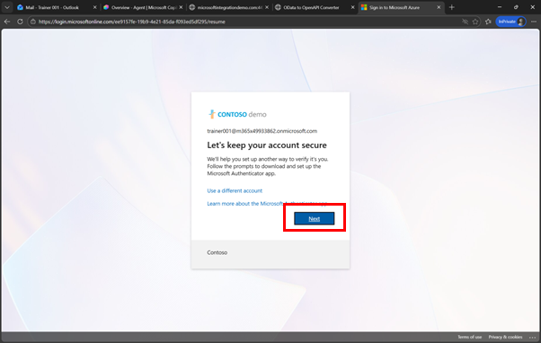 
 
### Run through enrollment process
As before run through the process to add the user to your Authenticator app
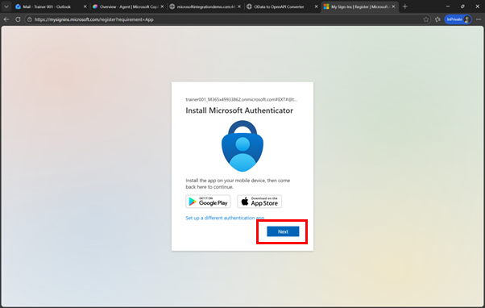
 
 
 
 
## Import your API

### In Azure API Management
Now you are in Azure API Management. This is one instance that is used by  all participants. Please don’t delete any existing APIs and only work with your own

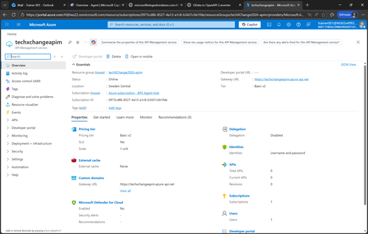 
 
### Managing APIs
Expand **API** and click on **APIs**

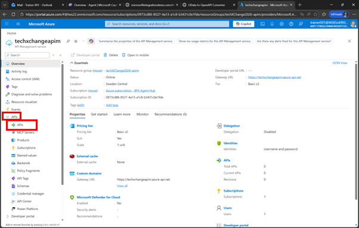 
 
### Define API from OpenAPI specification
Scroll down and click on OpenAPI

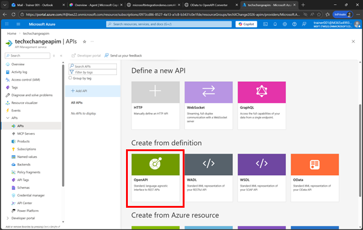
 
### Upload OpenAPI Specification
Click on **Select a File** and select the **$metadata-openapi.json** file that we converted and downloaded before in Step 3.1.5

> [!NOTE]
> If you had issues converting the file, you can find another file [here](../files/$metadata-openapi.json)


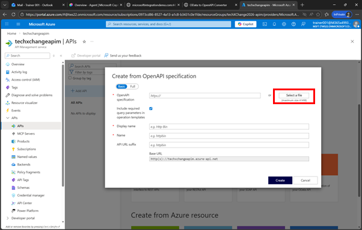 
 
 ### Configure the Displayname & more
For the **API URL Suffix** enter your ID, e.g. 
```text
student0XX
``` 
with your student number, 

Make also sure to adjust the **display name** and add 

```text
student0XX GWSAMPLE_BASIC
```  

(the Name should be automatically be adjusted)

then click on **Create**

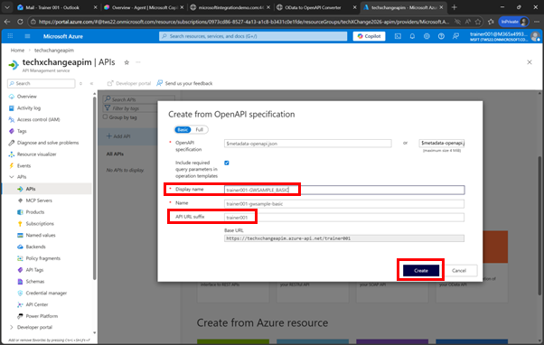 
 
From now on, please only use your API, e.g. **student0XX GWSAMPLE_BASIC**
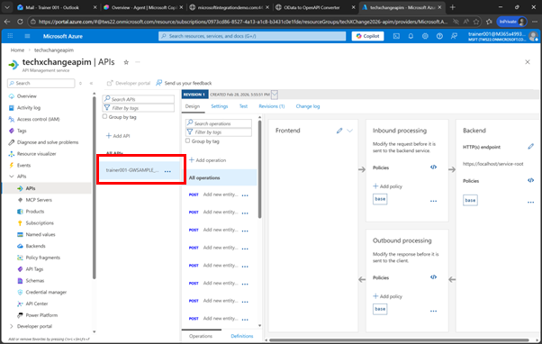
 
## Configure authentication

### Configure authentication
Next we will configure the authentication. Here you would now setup principal propagation / SSO. In our scenario we are going to do basic authentication with a username and password that is already configured as “Named values” pair. In order to use that configuration, click on the *Policies Code editor*

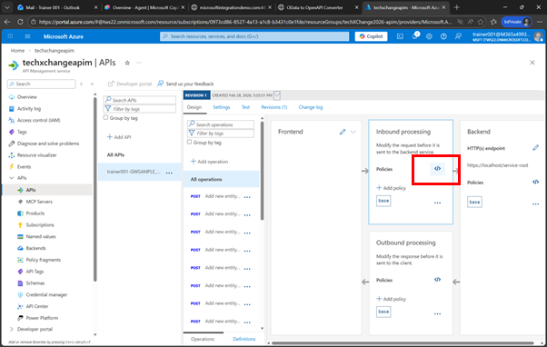 
 
### Enhance the policy
 Under     
 ```xml
 <inbound> 
    <base /> 
 ```
 add the following line. This will fetch the username and password from the Named Value store and add it to an authorization header for each call to the backend system
````xml
<authentication-basic username="{{sap-user}}" password="{{sap-password}}" />
````

And click on **Save**

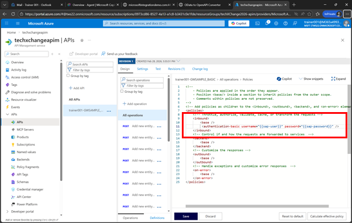 

> [!NOTE]
> The full policy should now look like
> 
```xml
<!--
    - Policies are applied in the order they appear.
    - Position <base/> inside a section to inherit policies from the outer scope.
    - Comments within policies are not preserved.
-->
<!-- Add policies as children to the <inbound>, <outbound>, <backend>, and <on-error> elements -->
<policies>
    <!-- Throttle, authorize, validate, cache, or transform the requests -->
    <inbound>
        <base />
        <authentication-basic username="{{sap-user}}" password="{{sap-password}}" />
    </inbound>
    <!-- Control if and how the requests are forwarded to services  -->
    <backend>
        <base />
    </backend>
    <!-- Customize the responses -->
    <outbound>
        <base />
    </outbound>
    <!-- Handle exceptions and customize error responses  -->
    <on-error>
        <base />
    </on-error>
</policies>
```

 
## Adjust the settings

### Adjust the settings
Now click on **Settings**

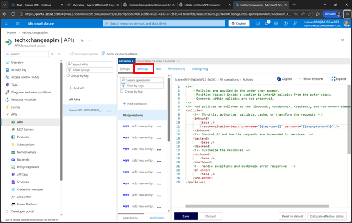 
 

### Change the target URL
And change the **Web Service URL** to 

```text
https://microsoftintegrationdemo.com:44301/sap/opu/odata/IWBEP/GWSAMPLE_BASIC
```

and click on **Save**

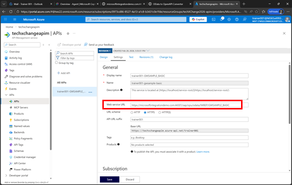 
 
### Uncheck Subscription Required
On the same screen, scroll down and uncheck “**Subscription required**” and click on **Save**
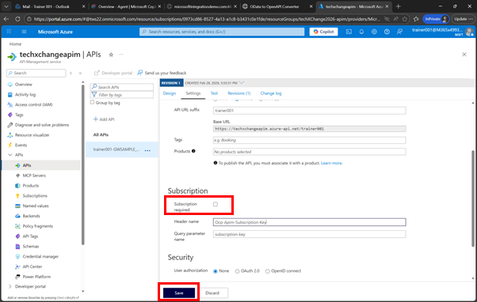 
 
## Test the API

### Test the API
Now click on **Test**, select the *Entity Type* ```Get entities from BusinessPartnerSet``` 
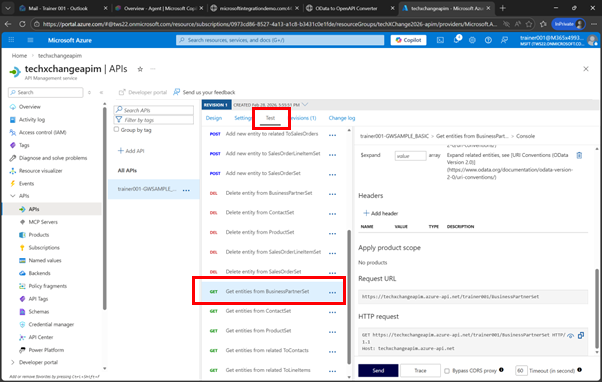 

### Submit the request
And click on **Send**

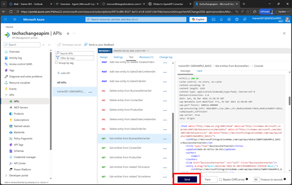 

 
If you scroll down you should see **HTTP/1.1 200 OK** and lots of Business partners
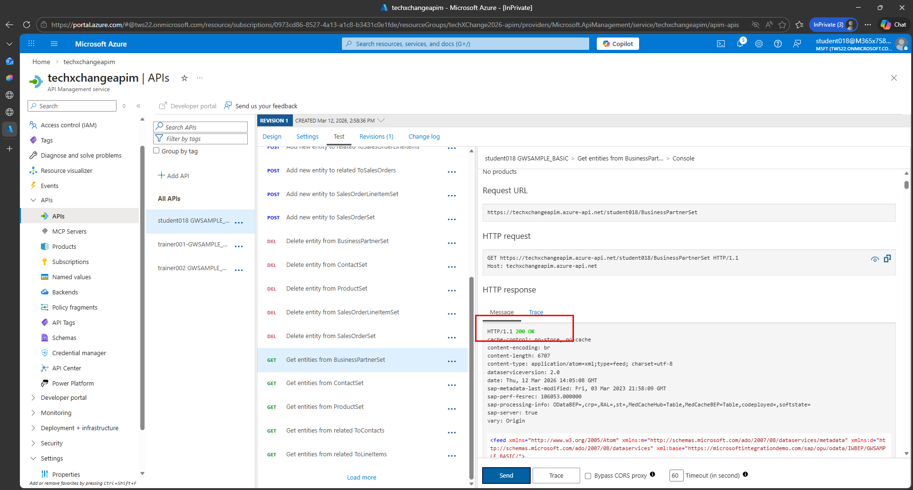


# Where to next?

[< 🤖 Quest 1](Quest1.md) - **[🔧 Quest 3 >](Quest3.md)**

[🔝](#)
