# Quest 3: Create an MCP Server
[< 🔌 Quest 2](Quest2.md) - **[Quest 4 >](Quest4.md)**

## Create an MCP Server

### Navigate to MCP
With this API now managed in Azure APIM, we can create an MCP Server out of it. Select **MCP Servers** on the left hand side
 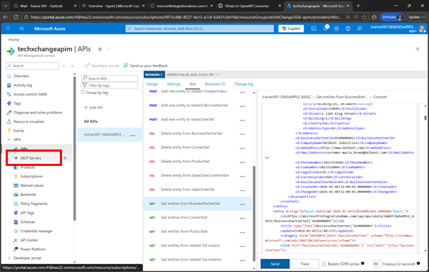 

Click on **Create MCP Server** and select **Expose an API as an MCP Server**
 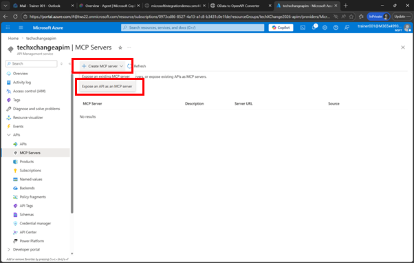 
 
Under **API** select the API that you just created, e.g. ```student0XX-GWSAMPLE_BASIC``` 
 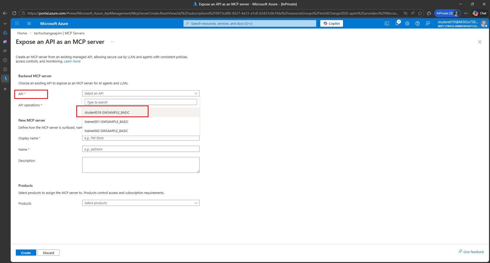 
 

From **API Operations**, select 
* Get entity from BusinessPartnerSet
* Get entity from ProductSet
* Get entity from SalesOrderSet
 
 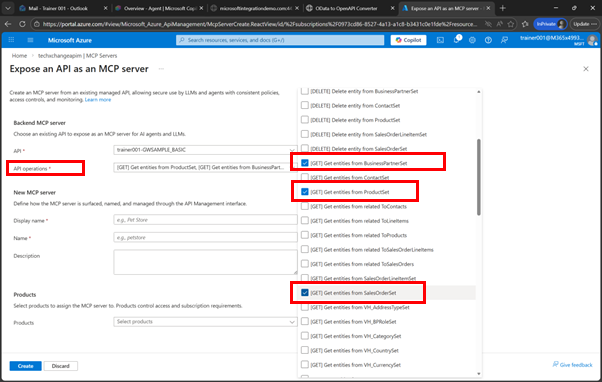 
 
For the Display Name enter 
```text
student0XX-SAP Products, Business Partner and Sales Orders
```

 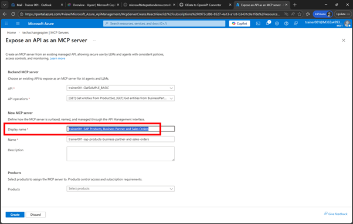 
 
As the description enter

```text
This MCP Server returns information about Products, Business Partners and Sales Orders from your SAP System
```

and click on **Create**

 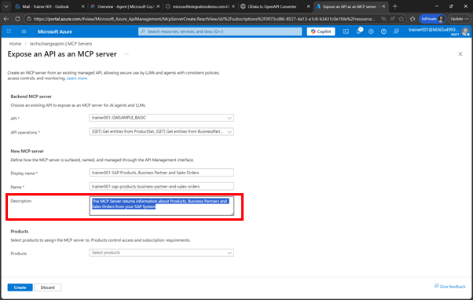 
 
Now your MCP Server has been created click on **Copy** to note down the URL of your MCP Server (e.g. copy it to Notepad), 
e.g. 
```text
https://techxchangeapim.azure-api.net/trainer001-sap-products-business-partner-and-sales-orders/mcp
```

 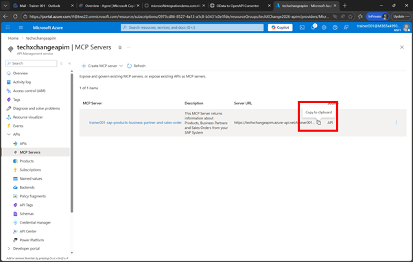 
 


## OPTIONAL 
<details><summary>Test via MCP Inspector</summary>

The [MCP Inspector](https://modelcontextprotocol.io/docs/tools/inspector) from Anthropic allows you to test the basic features of an MCP Server. It helps you to evaluate if the MCP Server you created is actually working. 


If you have node.js installed on your laptop, feel free to run 
```text
npx @modelcontextprotocol/inspector
```

 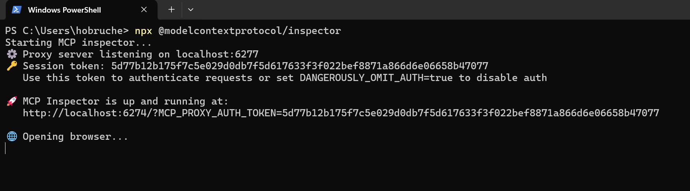 

After that a new Browser window should open with the MCP Server up and running. From there copy the URL of the MCP Server in Azure API Management to the MCP Inspector and click on Connect

 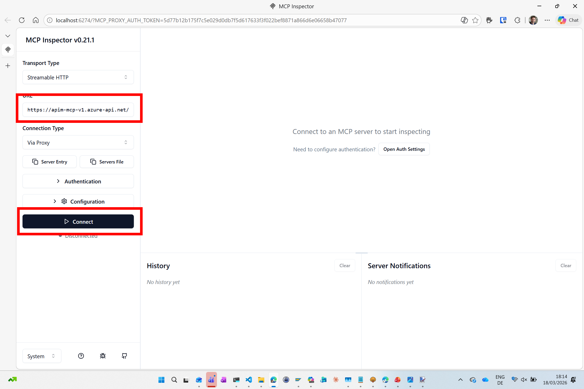 

Clicking on **List Tools** shows all the Tools or Entity Types that you defined in Azure APIM Before. Click on **getEntitiesFromSalesOrderSet** 

 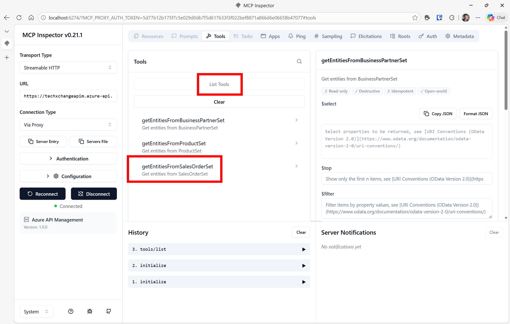 


If you scroll down and click on **Run Tool** you should be able to fetch Sales Orders from the SAP System via the MCP Server. 

 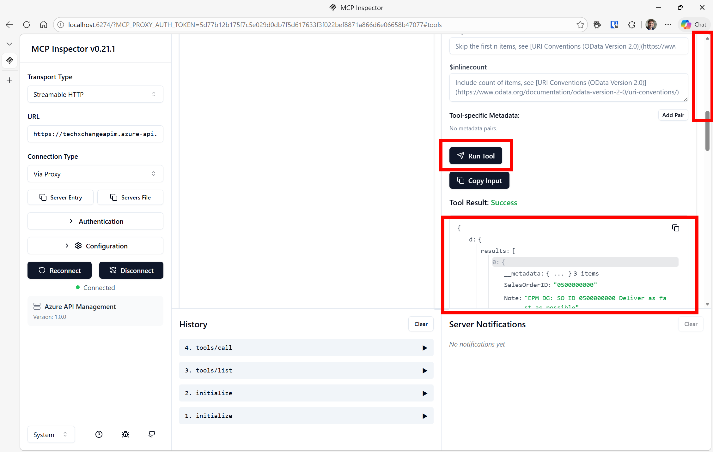 
</details>


# Where to next?

[< 🔌 Quest 2](Quest2.md) - **[Quest 4 >](Quest4.md)**

[🔝](#)
