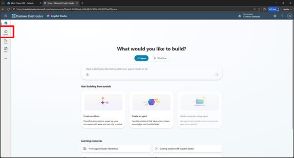
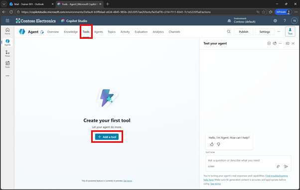
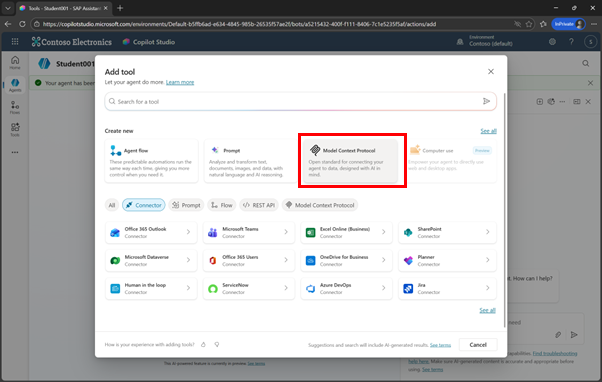
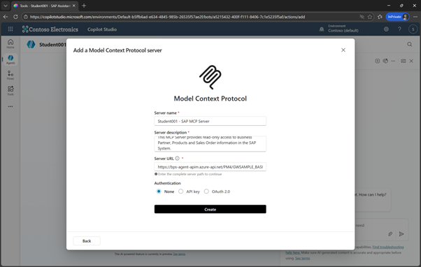
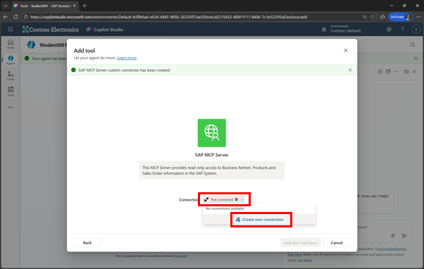
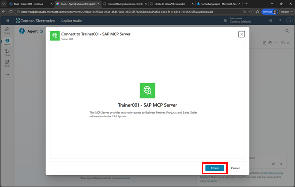
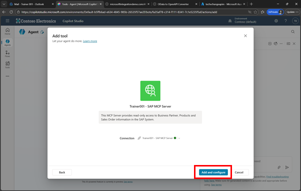
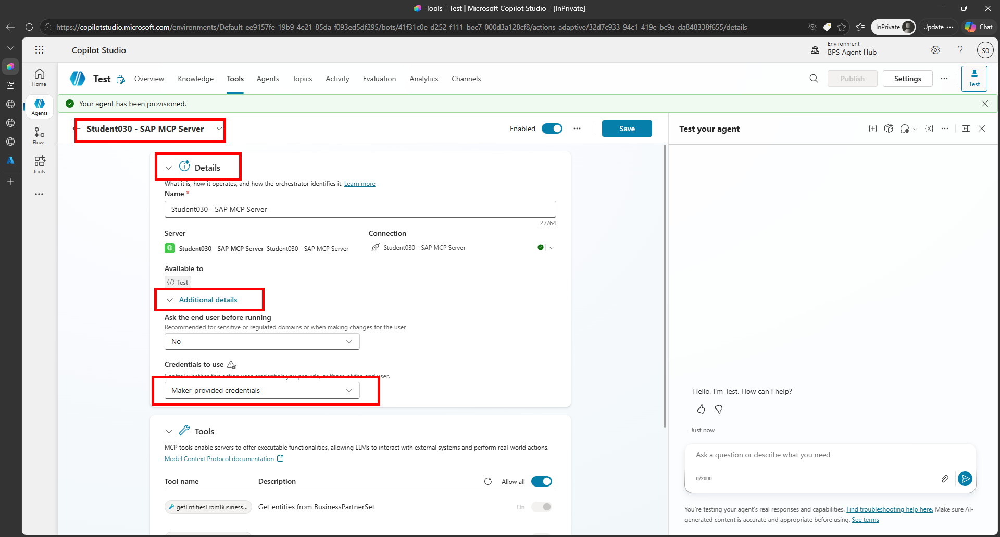

# Quest 4: Add the MCP Server to Copilot Studio
[< 🔌 Quest 3](Quest3.md)  - **[Quest 5 >](Quest5.md)**

## Add the MCP Server to Copilot Studio

Now we are ready to test and integrate the MCP in Copilot Studio. 
Go back to **Copilot Studio** windows and go to the **Agent**
If you do not have the Agent open anymore, click on Agents and select your Agent

> [!NOTE]
> Feel free to create a new Agent, e.g. GWSAMPLE - MCP

  

From the **Tools** menu, click on **+Add a tool**

  
 

Click on **Model Context Protocol**

  
 

Now enter the following values

* Server name: 
```text
Student0XX - SAP MCP Server
```

* Server Description: 
```text
This MCP Server provides read-only access to Business Partner, Products and Sales Order information in the SAP System.
```
* Server URL: 
```text
https://syntax2026apim.azure-api.net/student030-sap-products-business-partner-and-sales-orders/mcp
``` 
(use the one that you created in the last step of Quest 5 before)

and click on **Create**

> [!Note]
> In a production environment you would select OAuth and configure the principal propagation flow. 

  
 

The tool is added and now you need to connect to the MCP Server. Click on **Not Connected** and select **Create new connection**

  

 
The new connection is created. Click on **Create**

  
 
Click on **Add and configure** to add the new MCP Server to your Copilot Studio agent

  
 
As before to simplify the setup, select the **Maker Provider** COnfiguration and click on **Save**

  

# Where to next?

[< 🔌 Quest 3](Quest3.md) - **[Quest 5 >](Quest5.md)**

[🔝](#)

