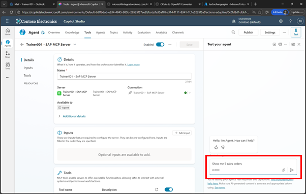
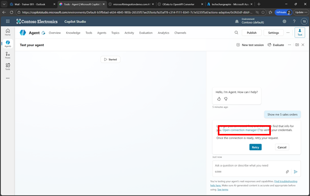
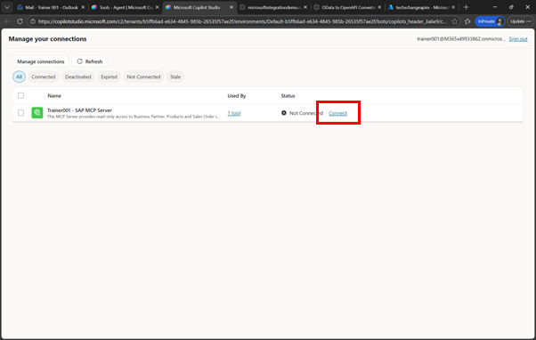
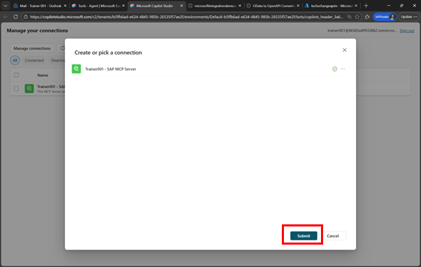
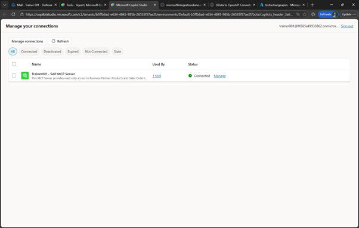
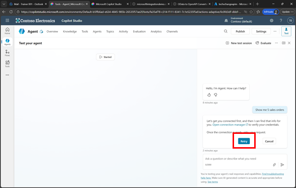
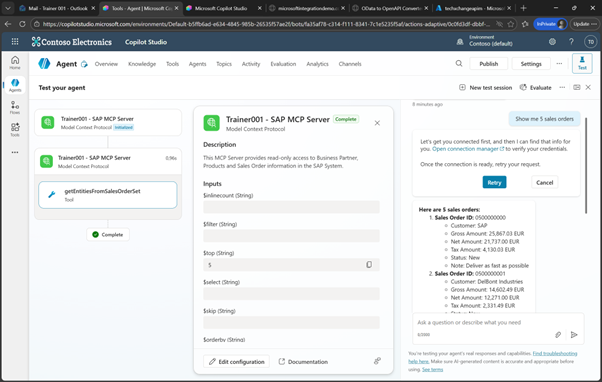

# 🔧 5. Challenge 5: Exposing APIs via MCP Server
[< 🔌 Quest 4](Quest4.md)  - **[Quest 6 >](Quest6.md)**

## 7.1 Test the new Agent
Now we are ready to test the new agent and access data from the SAP system


In the **Test your agent** screen, enter a question, e.g. ```Show me 5 sales orders```

  

Since we are now testing the agent as an end-user we need to authenticate to the MCP server. Click on **Open connection manager** to open the connection options

  
 

In our case we don’t need to provide any additional authentication details. Just click on **Connect**

  

 

The connection should now show a successful connection. Click on **Submit** 

  
 
With the status of the connection now showing *Connected*, switch back to the browser window with Copilot Studio

  
 

Where you can click on **Retry** or enter your question again:

  
 

Now the call to the MCP Server should be executed. You can see that the *getEntitiesFromSalesOrderSet* has been executed. 

  
 
Ask additional question to explore what is possible retrieving Sales Order, Business Partner and Product related information, e.g.
* show me 5 open sales orders
* Show me all sales orders with a net amount over 10,000
* Show me sales orders created in the last 30 days
* What is the total net amount of all open sales orders?
* Which business partner has the most sales orders?
* Find the latest sales order for customer SAP
* show me 5 business partners
* Find business partners whose name contains "Tech"
* show me more details about BP 0100000000
* How many business partners are there in total?
* What is the average order value per business partner?
* show me 5 products
* Show me products with a price above 500
* Show me products in category Tablets
* Show me the details of product HT-1000
* Which customers generated the highest revenue last quarter, and which products contributed most to that revenue?


# Where to next?

[< 🔌 Quest 4](Quest4.md) - **[Quest 6 >](Quest6.md)**

[🔝](#)
