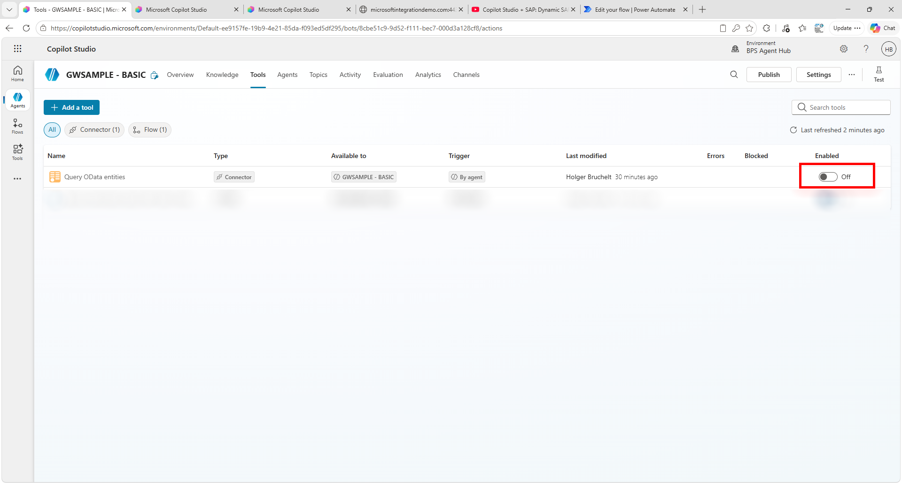

# Copilot Studio & SAP: Working with RFCs and BAPIs

**[🤖 Quest 1 >](student/Quest1.md)**

Although OData servicesare the recommended way to interact with your SAP system, RFCs and BAPIs are still used quite frequently. Especially in on-premises or ECC systems, thousands of RFCs are still available. 

Copilot Studio (and the Power Platform) offer a very strong integration of BAPIs. For this customers need to install the on-premises data Gateway. We have done this already in our lab. 

In order to get started, go back to Copilot Studio and disable the Query OData entities and MCP Server integration we created previously. 

>Note:
This is just to ensure that in our test not the previous tools are being called. In a real scenario the description of the individual tools would ensure that the right tool is called. 

Now let's go to the next section and start creating the first SAP ERP based tool!

## 📢Feedback

This repos encourages contributions and feedback via the [GitHub Issues](https://github.com/hobru/Microsoft-Copilot-Studio-und-SAP/issues/new/choose).

## Where to next?

**[🤖 Quest 1 >](student/Quest1.md)**

[🔝](#)
