# Quest 1: Getting started with RFC
[🏠Home](../../README.md) - **[🔌 Quest 2 >](Quest2.md)**

## SAP ERP Connector
As before the first step is to go to Tools and **+Add a tool**
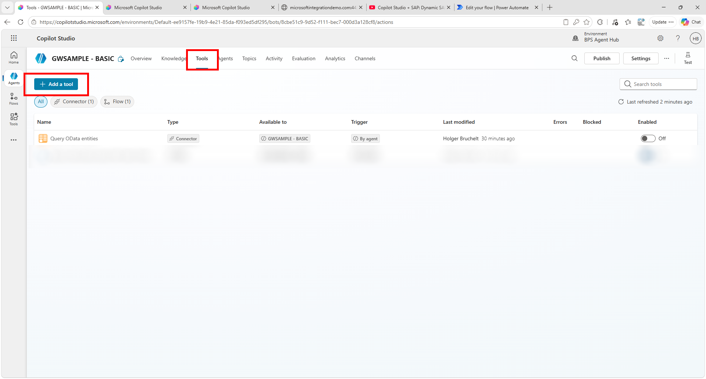

Unlike before we will not call the connector directly, but wrap it in an Agent Flow. For this select **Agent Flow**

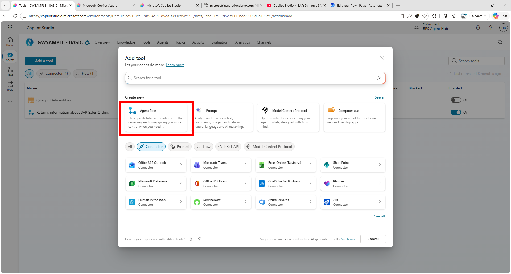

In the Agent Flow designer we first have to tell the Agent that is calling this flow, that we need an input parameter: the Sales Order number for which we want to fetch the status. 

Expand the **When an agent calls the flow** step and click on **+ Add an input**

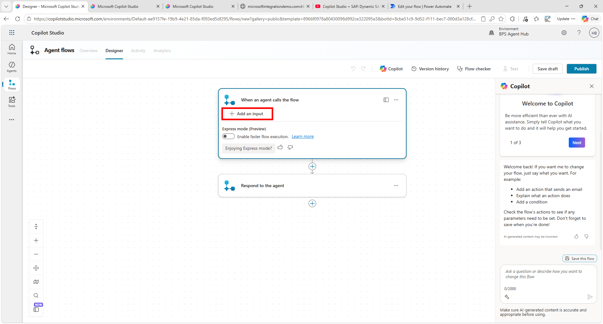

Select **Text**

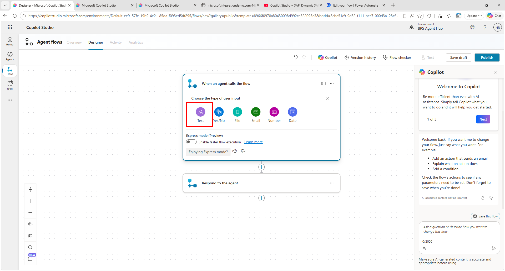

enter the text ````Sales Order ID```` and click on the **+**

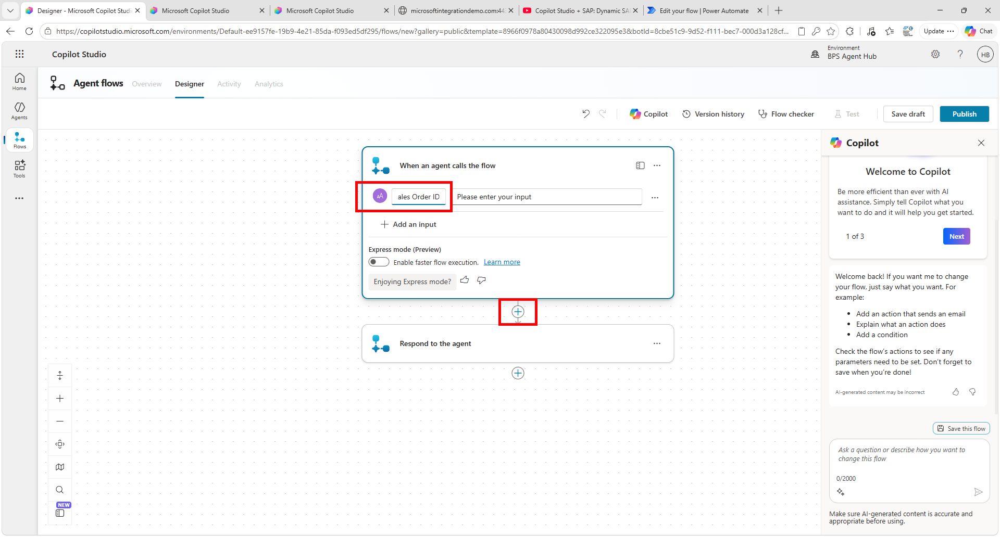


In the *Add an action* screen search for ````SAP ERP```` and select the **Call SAP function (V3)** action

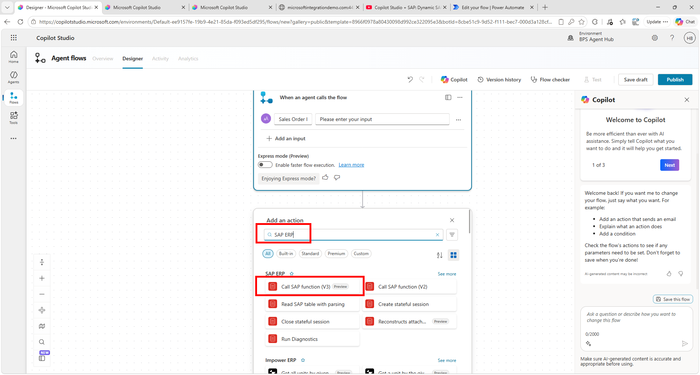

Since this is your first connection to the SAP system, you have to create a new connection. Enter the following values:
Connection name: Connection to PM4
Data Gateway: Select opdg-pm4
SAP Username: SYNTAX01
SAP Password: <as shared>

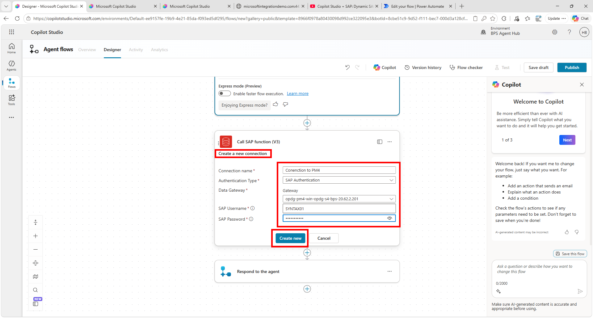


Now you are ready to connect to the SAP system. Enter the SAP System name and RFC name as follows:
SAP System: 
````json
{"AppServerHost": "10.15.0.6", "Client": 400, "SystemNumber":"01", "LogonType":"ApplicationServer"}
````
RFC name: BAPI_SALESORDER_GETSTATUS

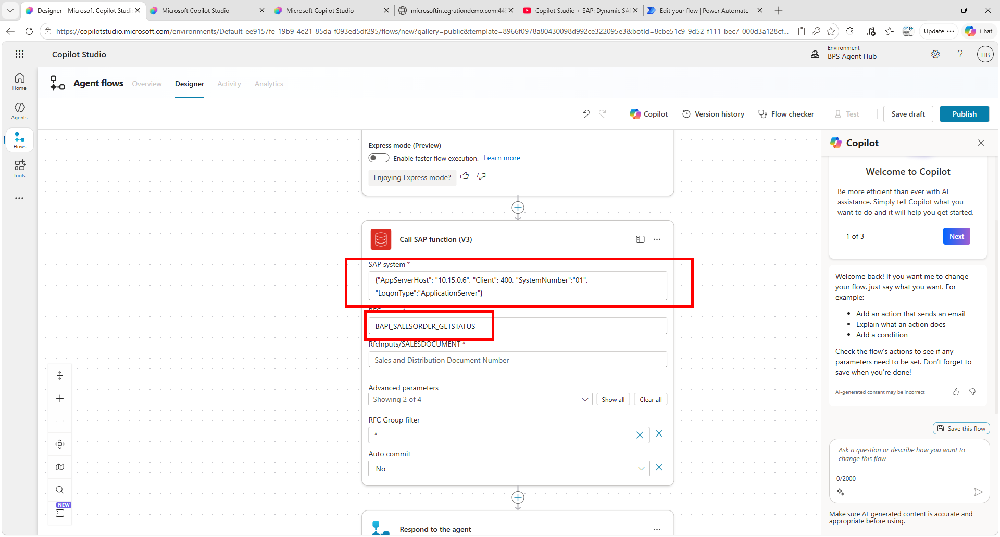


If everything is correct, you should see a new field *RfcInputs/SALESDOCUMENT* being displayed. Click on the field and on the Flash that is appearing. Now you can select the **Sales Order ID** which we defined as a required input parameter in the first step

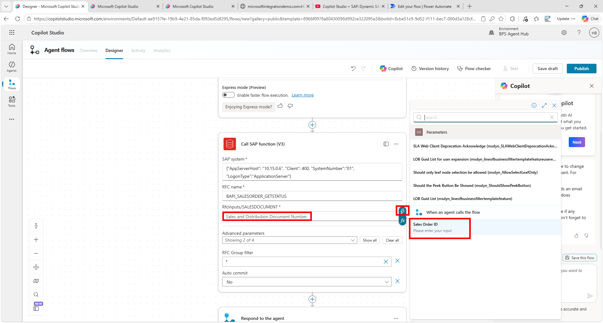


As a final step we need to tell the Agent flow what to return to the agent. For this go to the last step **Respond to the agent** and click on **+ Add an output**

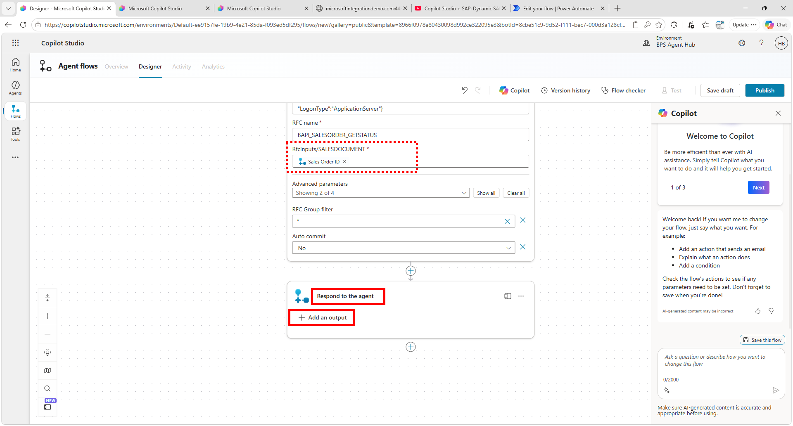

As before select Text and then provide a name **Sales Order Status** for the variable and via the flash icon select Body

> [!NOTE]
> You will have to click on **See more (52)** first to get the full list

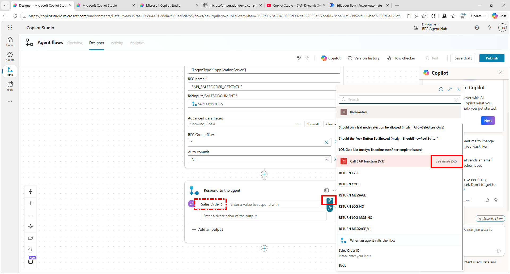

so that you can select **Body**

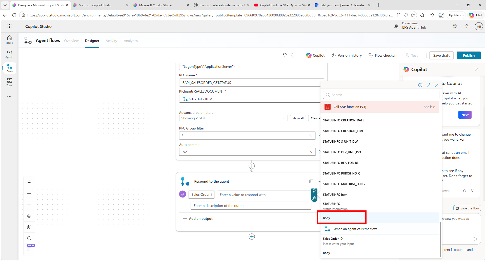

Now the response should look like this. Click on **Publish** to publish the agent

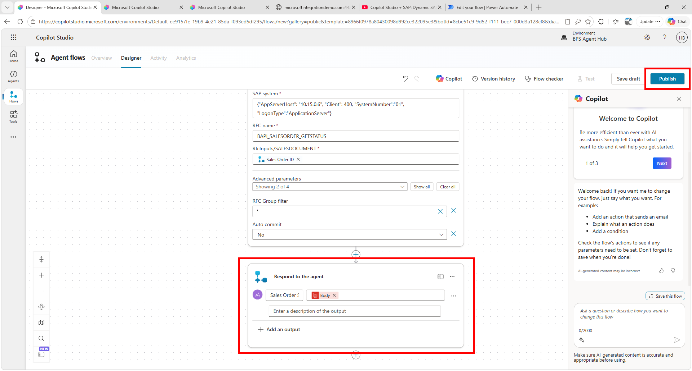

Once published don't go back to the agent just yet, but **Stay in the flow**

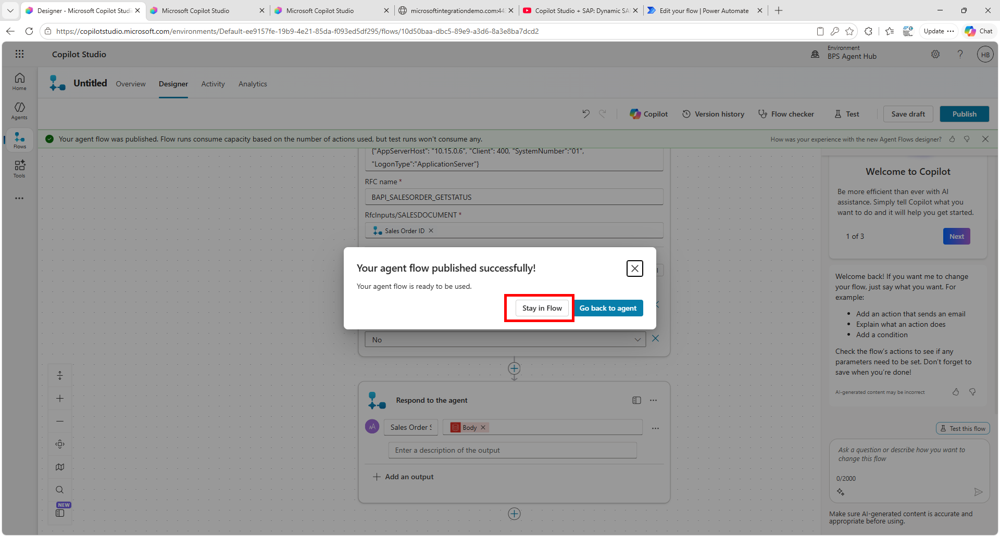

In the Overview Tab, click on the **Untitled** name and change it to ````SAP Sales Order Status Lookup````

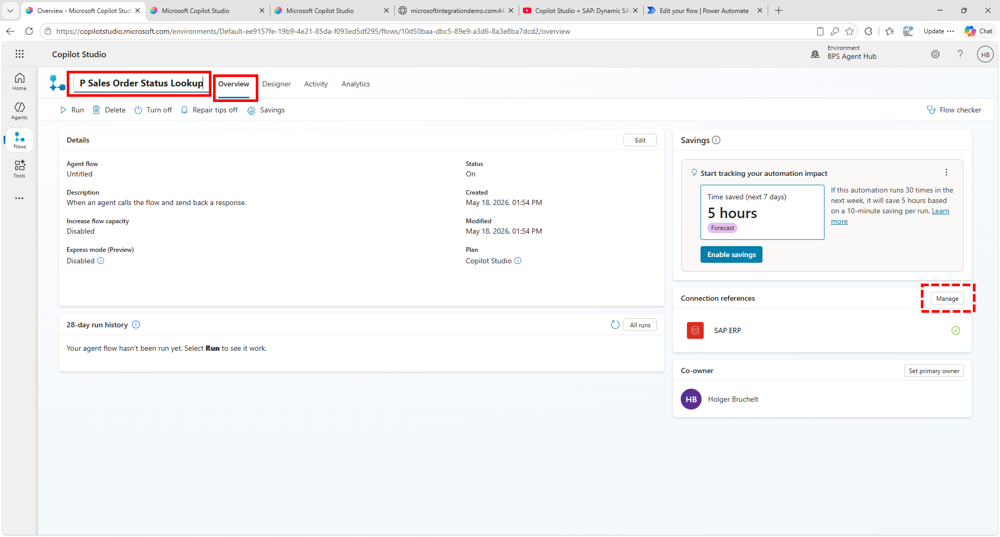

Then on the right under *Connection references* click on **Manage** and change and select the Connection that you had previously created. You will be prompted if you are sure to change the connection. Click on **OK** and then **Save**

> [!NOTE]
> This simplifies the interaction from the agent later on. For Single Sign-On we would keep this as is.

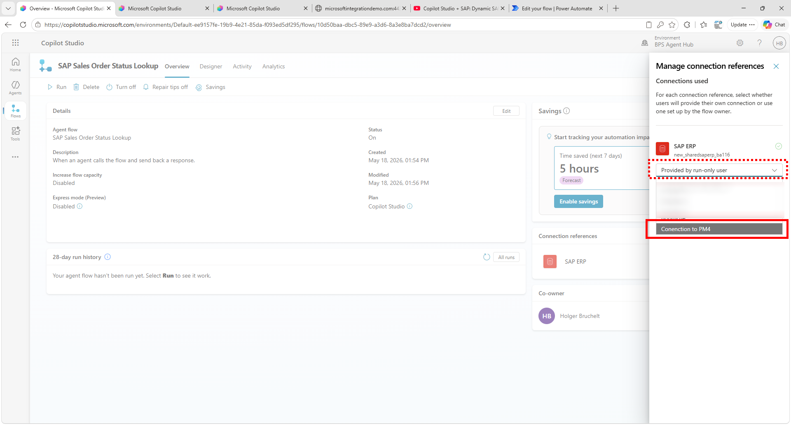

Now it is time to integrate this new flow in the agent. 


# Where to next?

[🏠Home](../../README.md) - **[🔌 Quest 2 >](Quest2.md)**

[🔝](#)
