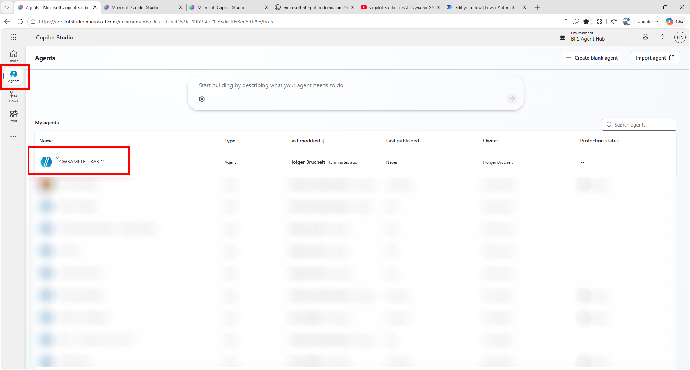
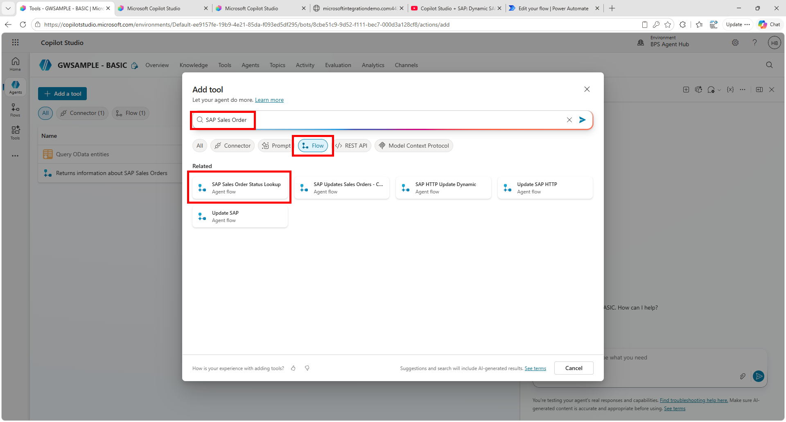
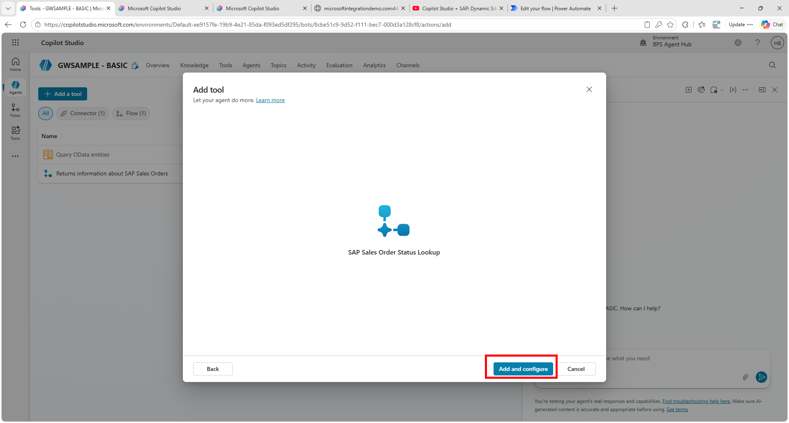
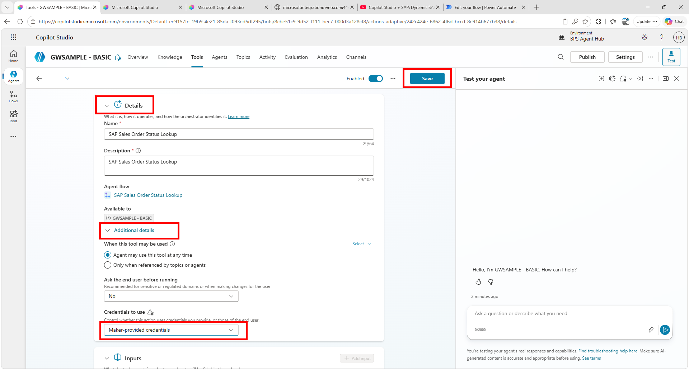
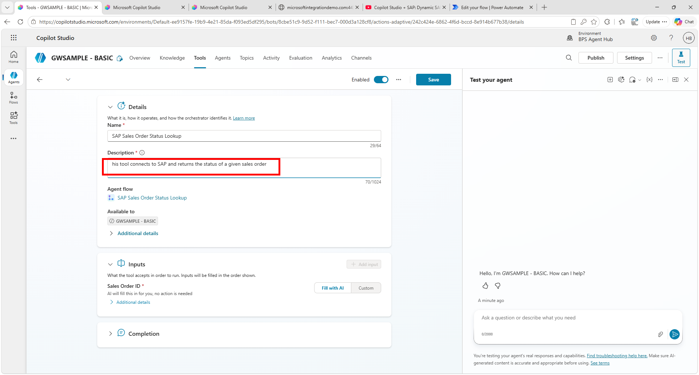
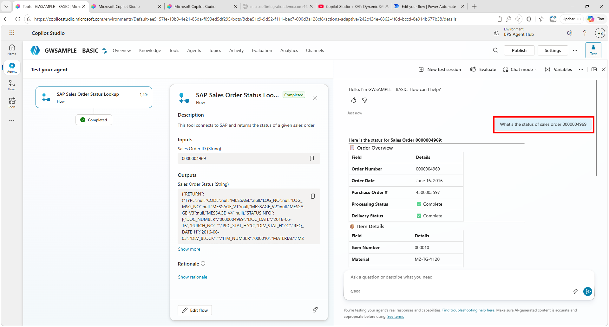

# Quest 2: Calling Flows from an agent
[< 🤖 Quest 1](Quest1.md) - [🏠Home](../../README.md)

## Calling a flow/workflow from the Agent
On the left hand side, click on Agents and select the **GWSAMPLE-BASE** agent we had previously created. 



Go to **Tools** and click on **+Add a tool**. 

Select flow/workflow and either search for **SAP Sales Order** or select the **SAP Sales Order Status Lookup** flow/workflow that we just created



> Note:
Sometimes updating the name of a flow/workflow takes some time. In case you don't see your **SAP Sales Order** flow, look for a flow/workflow named **Untitled**

Click on **Add and configure** to add the flow/workflow to your agent



As before expand the **Details** and **Additional details** screen and change the **Credentials to use** to **Maker-provided credentials**. Make sure to click on **Save**



We also want to update the description to: ````This tool connects to SAP and returns the status of a given sales order````



Now we are good to go. On the right side enter ````What's the status of sales order 0000004969```` 




# Where to next?

[< 🤖 Quest 1](Quest1.md) - [🏠Home](../../README.md)

[🔝](#)
